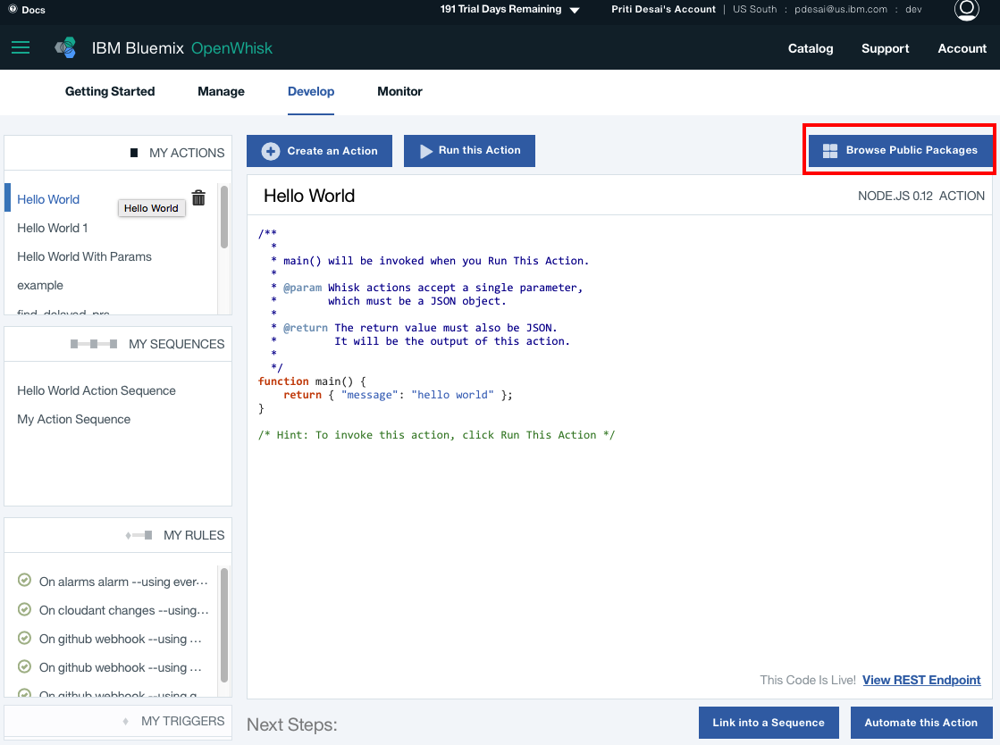
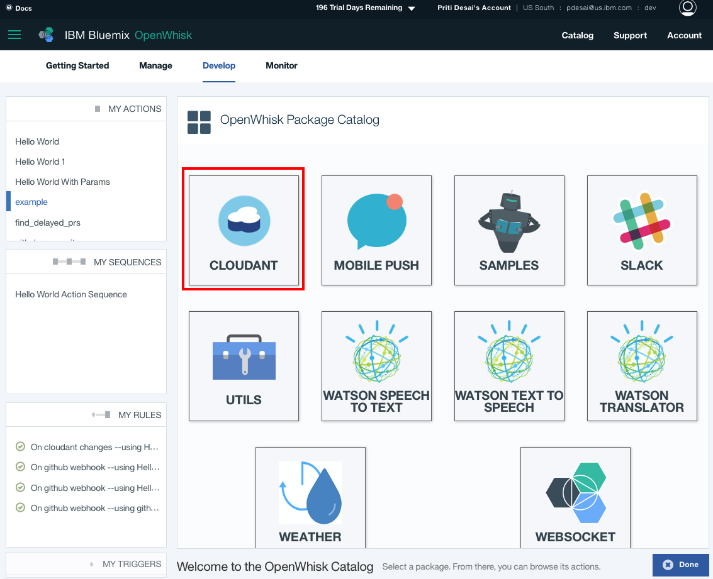
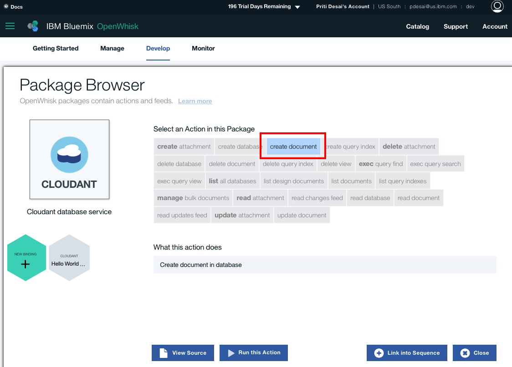
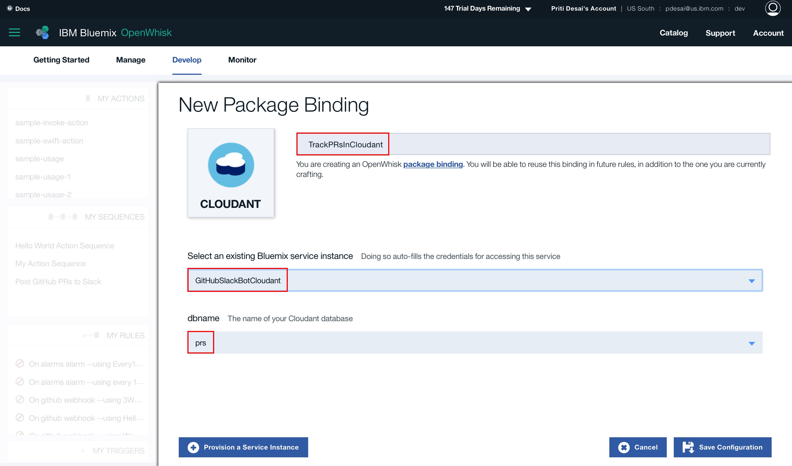
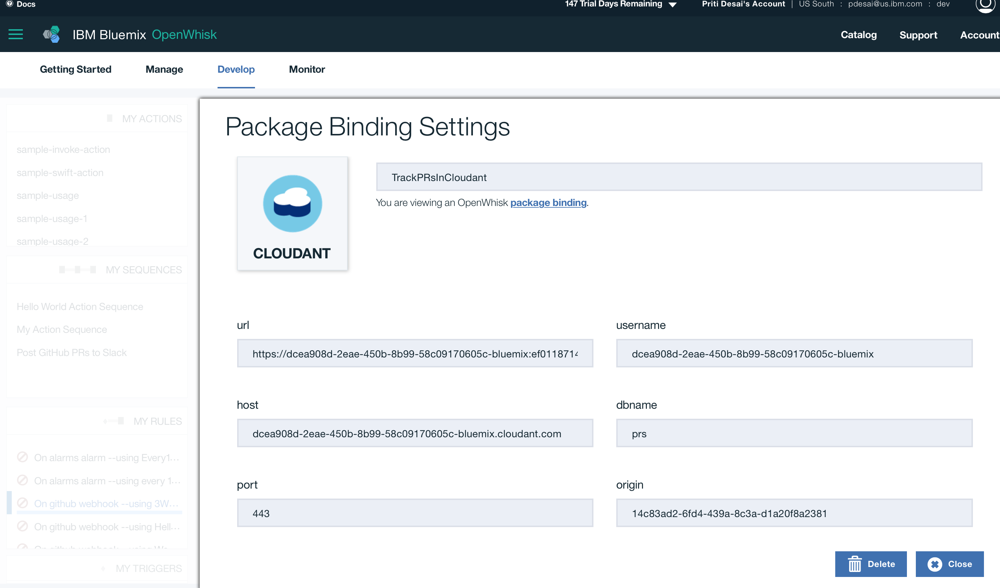
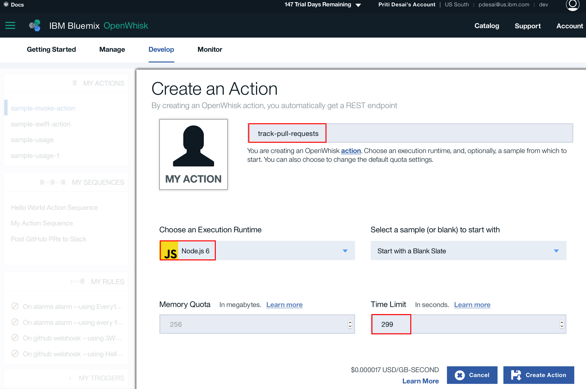
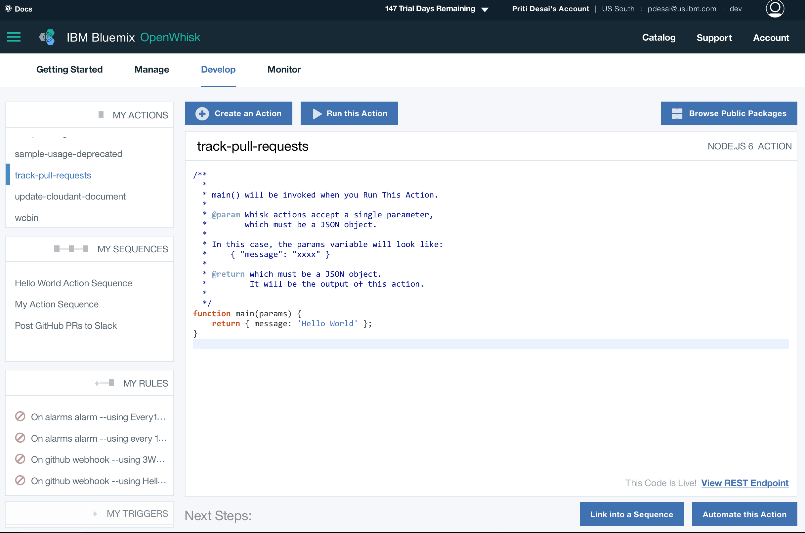
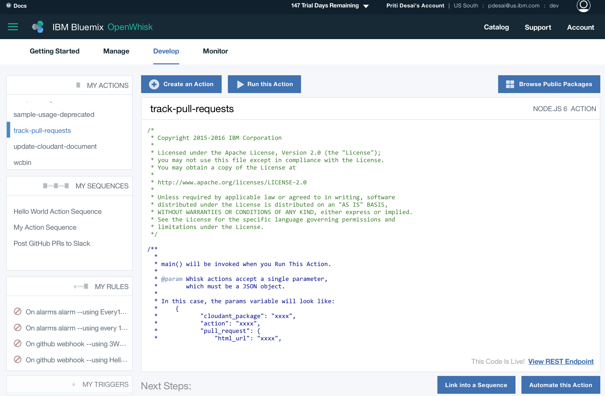

# GitHubSlackBot using IBM Bluemix

## Step 1: Create Cloudant Service - GitHubSlackBotCloudant

If you don't have one already, create a new Cloudant NoSQL database by following tutorial on [Creating a Cloudant instance on Bluemix](https://console.ng.bluemix.net/docs/services/Cloudant/tutorials/create_service.html#creating-a-cloudant-instance-on-bluemix) or [GitHub IBM Bluemix docs](https://github.com/IBM-Bluemix/docs/blob/master/services/Cloudant/tutorials/create_service.md).

Also, [create a new database](images/Step1-CreateANewDatabase.png) if you don't have one.

## Step 2: Create Cloudant Package Binding - TrackPRsInCloudant

On IBM Bluemix portal, select **"Browse Public Packages"** to create a new cloudant package.

Select **"Cloudant"**:

Select **"Create document"** action:

Select Cloudant instance we just created in previous step named **"GitHubSlackBotCloudant"** and database.

It creates a new package **"GitHubSlackBotCloudant"** and you can view the details:

## Step 3 - Create an Action - track-pull-requests

Creating an action here results in a track-pull-requests.js file with:

Now, copy code from [track-pull-requests.js](../openwhisk/actions/js/track-pull-requests.js) and paste it here.

