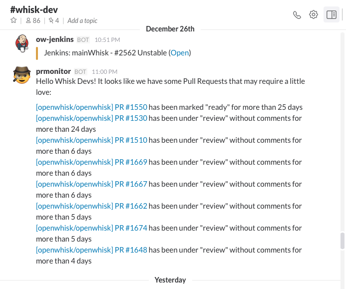
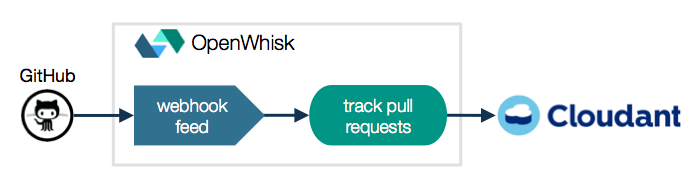
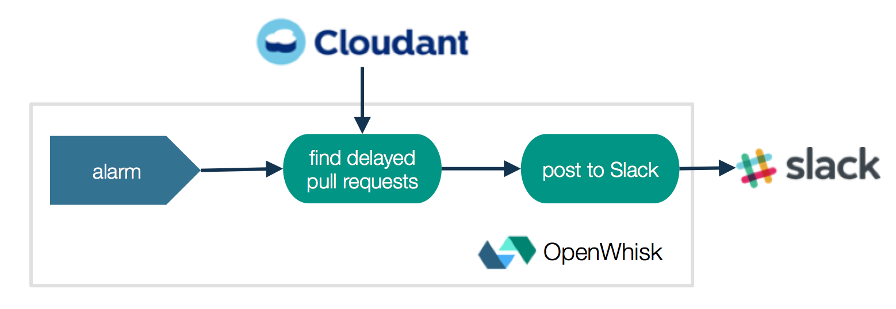

# OpenWhisk – Drinking Our Own Champagne

OpenWhisk is an Apache incubator project that provides an open source serverless platform. Its source code is available at https://github.com/openwhisk/openwhisk. 

OpenWhisk project developers are using the actual running OpenWhisk code itself to improve its own Continuous Development and Integration (CD/CI) processes. This blog introduces a bot [openwhisk-GitHubSlackBot](https://github.com/openwhisk/openwhisk-GitHubSlackBot) which is designed to post updates to Slack when a GitHub Pull Request is ready for merge or a list of pull requests are under review for certain days and haven’t merged. GitHubSlackBot is designed and built using OpenWhisk actions(functions).  This is the first blog in a series, we will look at how the project developers are using OpenWhisk to get notifications when their builds are complete through [Travis](https://travis-ci.org/openwhisk) in next blog post.

Here is a sample of notification received on Slack:

## Architecture

The GitHub Slack Bot is built on a set of three actions (like microservices) which are invoked either by some triggers or by another action in a sequence of dependent actions. One action is invoked by regular pulll request updates received from a GitHub repository and an action sequence (consisting of two actions) is triggered periodically by an internal OpenWhisk alarm (similar to a cron job).

Each of the actions in GitHub Slack Bot are implemented in JavaScript, using the Node.js runtime provided by OpenWhisk on Bluemix. Here’s what each action does within its triggered flow.

### Invoked by GitHub repository when any pull request changes

* **Track pull requests** - An action that is subscribed to "pull_request" events on GitHub repository. GitHub repository sends pull request payload via HTTP POST which is stored in Cloudant to form a data set of pull requests. Data set in Cloudant is updated when a pull request is:

  * labeled "ready" or "review" or
  * unlabeled ("ready" or "review" label is removed) or
  * updated due to a new push in the branch that the pull request is tracking or
  * closed

### Invoked twice a day by an Alarm trigger

The sequence of actions is invoked by Alarm trigger, which then starts a chain of microservices to retrieve list of delayed pull requests and compose notifications which are posted on Slack.

* **Find delayed pull requests** - an action that is invoked every 12 hours with Cloudant data set, retrieves a list of pull requests which are ready to be merged and older than certain days.   

* **Post to Slack** - an action invoked by _find delayed pull requests_ action. It takes a list delayed pull requests and composes message with pull requests, ID, label, and age in days to post on Slack.

Here is the high-level workflow diagram:

If you would like to try this yourself, you can find the step-by-step installation instructions [here](https://github.com/openwhisk/openwhisk-GitHubSlackBot#installation) and demo [here](https://youtu.be/vEpuxcpOaEA).

Enjoy!!!
